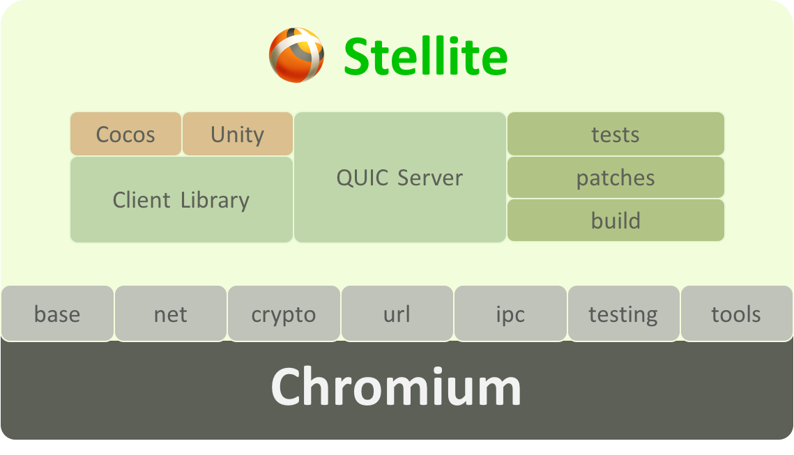
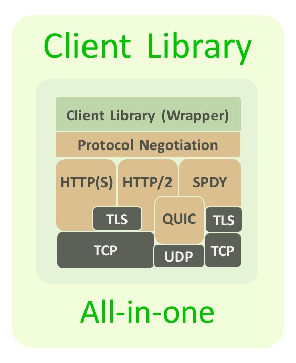

# Welcome to Stellite

Stellite project is a client library and server application that offers an easy way to develop, build, and implement client/server running primarily over the QUIC protocol developed by Google as part of the Chromium project. It aims to provide fast and stable connectivity to mobile applications.

Stellite is an open-source project developed by [LINE Corporation](http://linecorp.com/en/) based on the Chromium project.

Licensed under [Apache License 2.0](http://www.apache.org/licenses/LICENSE-2.0).

## Why QUIC?

Today, mobile application developers are struggling with challenges posed by constantly changing network environments; long connection time (RTT overhead), packet loss, handover failures, head-of-line blocking, duplicate congestion window, to name a few.

QUIC is a new transport protocol that can solve these problems by providing essential features as follows.

* Dramatically reduced connection establishment time
* Improved congestion control
* Multiplexing without head-of-line blocking
* Forward error correction
* Connection migration
* TLS-level security

See [QUIC docs](https://www.chromium.org/quic) provided by Google for more details.

## Stellite project stack

Stellite consists of the QUIC server and the client library on top of Chromium.

### Stellite QUIC server

Stellite QUIC server is based on the Chromium's QUIC simple server and provides the following features.

* Supports reverse proxy
* Supports multi-threading for enhanced performance
* Supports file-based logging

### Stellite client library

Stellite client library provides a protocol negotiation layer so that a mobile application can choose the most expedient protocol.

* Supports QUIC, SPDY, HTTP, HTTPS, HTTP2
* Easy to build, link, and integrate with mobile applications
* Includes a thread model to run network on a thread
* Uses a forward declaration and the Pimpl pattern to separate the Stellite implementation from the Chromium interface

## Getting started

* [How to build](./BUILD.md)
* [Client guide](./CLIENT_GUIDE.md)
* [Server guide](./SERVER_GUIDE.md)

## Read more

* [Release notes](./RELEASE.md)
* [Contributing](./CONTRIBUTE.md)
* [About QUIC](https://www.chromium.org/quic)

## License

Copyright 2016 LINE Corporation

Licensed under the Apache License, Version 2.0 (the "License");
you may not use this file except in compliance with the License.
You may obtain a copy of the License at

    http://www.apache.org/licenses/LICENSE-2.0

Unless required by applicable law or agreed to in writing, software
distributed under the License is distributed on an "AS IS" BASIS,
WITHOUT WARRANTIES OR CONDITIONS OF ANY KIND, either express or implied.
See the License for the specific language governing permissions and
limitations under the License.
